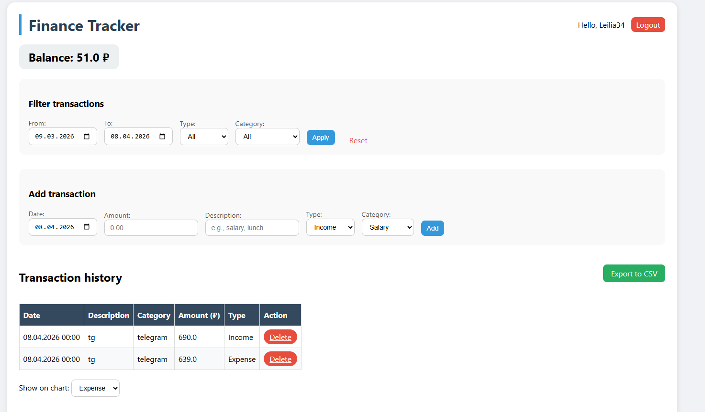
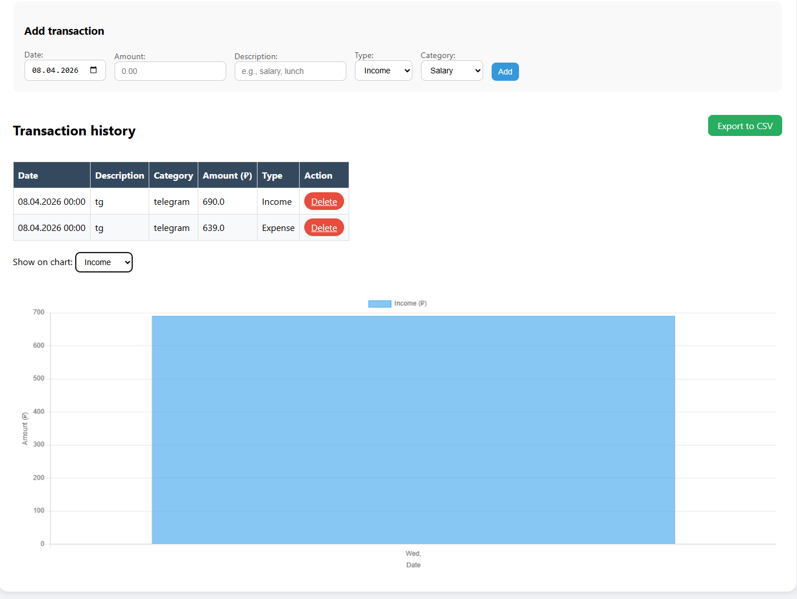
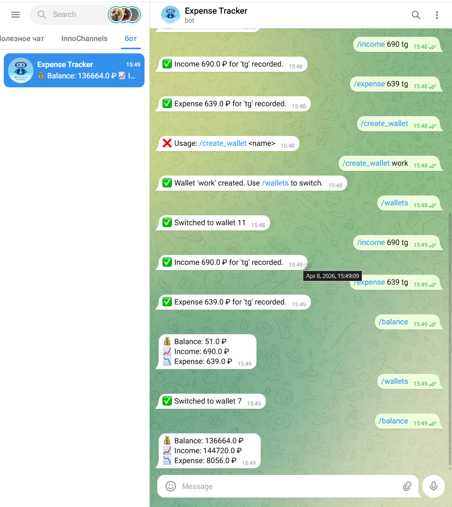

# Finance Tracker

## One-line description
A multi-user web application and Telegram bot for tracking personal income and expenses with multi-wallet support, charts, and CSV export.

## Demo
## Demo



## Product context
- **End users**: Individuals who want to manage their personal finances.
- **Problem**: It's hard to track where money goes and get a quick overview of balance and spending habits.
- **Your solution**: A simple web interface and a Telegram bot to add income/expense, view filtered transaction history, see charts, and export data.

## Features
### Implemented
- User registration and login (multi-user, isolated data)
- Add income and expense transactions with categories and custom date
- View transaction table and current balance
- Filter transactions by date range, type (income/expense), and category
- Interactive chart (toggle between income and expense)
- Delete transactions
- Export filtered transactions to CSV
- Docker containerization (web + PostgreSQL + bot)
- Telegram bot with commands:
  - `/balance` – show current balance
  - `/income <amount> <description>` – add income
  - `/expense <amount> <description>` – add expense
  - `/wallets` – list wallets
  - `/create_wallet <name>` – create a new wallet
  - `/link <username> <password>` – link Telegram to web account
  - `/logout` – unlink Telegram
  - Quick expense: just type `<amount> <description>`
- Multi-wallet support (one Telegram account can manage several independent wallets)

### Not yet implemented
- Editing transactions
- Budget limits and notifications

## Usage
1. Open the web app at `http://<your-vm-ip>:5002`
2. Register a new account or log in.
3. Add income/expense using the form.
4. Use filters to view specific transactions.
5. Switch chart between income and expense.
6. Use the Telegram bot: send `/start`, then `/link <web_username> <web_password>`, then start adding transactions.

## Deployment
- **OS**: Ubuntu 24.04 (or any Linux with Docker)
- **Requirements**: Docker, Docker Compose

### Step-by-step deployment
```bash
git clone https://github.com/Leilia34/se-toolkit-hackathon.git
cd se-toolkit-hackathon
docker-compose up -d --build
The web app will be available at http://localhost:5002 (or your VM IP).
The Telegram bot will start automatically.

Technologies
Backend: Flask (Python)

Database: PostgreSQL

Frontend: HTML, CSS, JavaScript (Chart.js)

Bot: python-telegram-bot

Containerization: Docker, Docker Compose

License
MIT
